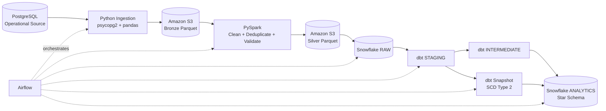

# End-to-End E-commerce Data Engineering Platform

An interview-ready data engineering project that implements a complete batch analytics pipeline from a transactional PostgreSQL source to curated Snowflake marts, with S3 Bronze/Silver layers, PySpark transformations, dbt modeling and testing, SCD Type 2 history, incremental processing, and Airflow orchestration.

## Business Goal

Build a production-style analytics pipeline for e-commerce data that can ingest operational data, preserve raw history, clean and deduplicate records, load a cloud warehouse, create dimensional models, enforce data quality, track customer attribute changes over time, process new orders incrementally, and orchestrate the workflow end to end.

## Architecture



## Technology Stack

- PostgreSQL — source OLTP database
- Python — ingestion and validation
- psycopg2 / pandas / PyArrow — extraction and Parquet generation
- Amazon S3 — Bronze and Silver storage layers
- PySpark — scalable cleaning, deduplication, and transformation
- Snowflake — cloud data warehouse
- dbt — staging, intermediate models, marts, tests, snapshots, incremental models
- Apache Airflow — pipeline orchestration and retries
- YAML — table configuration and dbt metadata/tests

## Data Flow

### 1. PostgreSQL Source

The project uses Olist-style e-commerce entities including:

- customers
- orders
- order_items
- order_payments
- products

### 2. Python Ingestion

The ingestion layer extracts PostgreSQL tables and writes partitioned Parquet files to the Bronze layer.

Implemented features:

- generic table extractor
- YAML-driven table configuration
- chunked extraction of 50,000 rows
- full and incremental load support
- watermark tracking
- row-count validation
- ingestion metadata

Metadata added during ingestion:

- `_ingested_at`
- `_batch_id`
- `_source_system`
- `_source_table`

Orders support incremental extraction using `order_purchase_timestamp` as the watermark column.

### 3. S3 Bronze Layer

Bronze stores source-aligned Parquet data partitioned by ingestion date:

```text
s3://data-engineering-project-kv/bronze/<table>/year=YYYY/month=MM/day=DD/
```

Bronze is intentionally append-oriented so historical ingestion batches remain available.

### 4. PySpark Bronze-to-Silver Processing

PySpark reads the complete Bronze history, validates rows, removes duplicates, and writes clean Silver datasets.

Examples of business keys used for deduplication:

- customers: `customer_id`
- orders: `order_id`
- order_items: `(order_id, order_item_id)`
- order_payments: `(order_id, payment_sequential)`
- products: `product_id`

Silver adds `_silver_processed_at` and rejects invalid records where required keys are missing.

A customer run processed 397,764 historical Bronze rows, removed 298,323 duplicate records, and produced 99,441 clean Silver customer rows.

### 5. Snowflake RAW Layer

Clean Silver Parquet files are loaded into `ECOMMERCE_DB.RAW` through an external S3 stage and Parquet file format.

Main Snowflake objects:

```text
Database:   ECOMMERCE_DB
Warehouse:  ECOMMERCE_WH
Schemas:    RAW, STAGING, ANALYTICS
Stage:      ECOMMERCE_DB.RAW.ECOMMERCE_SILVER_STAGE
File format: ECOMMERCE_DB.RAW.PARQUET_FORMAT
```

### 6. dbt Staging Layer

Staging models standardize warehouse source tables as views:

```text
stg_customers
stg_orders
stg_order_items
stg_order_payments
stg_products
```

The staging layer includes source validation and schema tests.

### 7. Intermediate Models

`int_order_items_aggregated` aggregates item-level data to one row per order before joining into facts. This prevents fact-table fanout and double counting.

### 8. Dimensional Model

The analytics layer follows a star-schema design.

Dimensions:

- `dim_customers`
- `dim_products`
- `dim_date`

Facts:

- `fact_orders`
- `fact_payments`

`fact_orders` has one row per order and includes item totals such as:

- `total_items`
- `total_item_value`
- `total_freight_value`
- `total_order_value`

`fact_payments` has one row per payment transaction using `(order_id, payment_sequential)` as its natural composite key.

## SCD Type 2 Customer History

Customer attribute history is captured with a dbt snapshot using the check strategy.

Tracked fields include:

- customer unique ID
- ZIP code prefix
- city
- state

The snapshot records validity windows through:

- `dbt_valid_from`
- `dbt_valid_to`

`dim_customers` reads only the current snapshot record where `dbt_valid_to IS NULL`, while historical customer versions remain available in the snapshot table.

A controlled test changed a customer from `franca / SP` to `test_city / TS`, ran the full pipeline, and verified that dbt closed the original record and created a new active version.

## Incremental dbt Modeling

`fact_orders` is materialized incrementally using Snowflake `MERGE` semantics.

Configuration:

```sql
{{
    config(
        materialized='incremental',
        unique_key='order_id',
        incremental_strategy='merge',
        on_schema_change='sync_all_columns'
    )
}}
```

During normal runs, only orders newer than the maximum processed purchase timestamp are selected. A synthetic order dated after the previous maximum timestamp was inserted and successfully merged without rebuilding the full fact table.

## Data Quality Strategy

The project includes 57 dbt tests covering:

- `not_null`
- `unique`
- `accepted_values`
- `relationships`
- source tests
- composite-key uniqueness
- non-negative monetary values
- order delivery timestamp logic
- item-count business rules

One known source-level referential-integrity condition contains 18 order-item product IDs without matching product records. This is treated as an observable data-quality issue rather than silently repaired.

## Airflow Orchestration

The Airflow DAG orchestrates:

```text
ingest_orders
    -> spark_clean_orders
    -> load_snowflake_orders
    -> dbt_run_staging
    -> dbt_snapshot
    -> dbt_build
    -> dbt_test
```

The DAG includes retries and failure propagation so downstream transformations do not execute when an upstream task fails.

The project currently includes active troubleshooting of Spark-to-S3 execution inside the Airflow runtime; the same Spark transformation works successfully from the project environment. This distinction is documented rather than hidden.

## Repository Structure

```text
ecommerce-data-platform/
├── config/
│   └── tables.yaml
├── data/
│   └── watermarks.json
├── ingestion/
│   ├── database/
│   │   ├── extract_postgres.py
│   │   └── postgres.py
│   └── utils/
├── spark/
│   ├── jobs/
│   │   ├── clean_customers.py
│   │   ├── clean_orders.py
│   │   ├── clean_order_items.py
│   │   ├── clean_order_payments.py
│   │   └── clean_products.py
│   └── utils/
│       ├── s3_paths.py
│       └── spark_session.py
├── scripts/
│   └── load_orders_to_snowflake.py
├── dbt/
│   └── ecommerce/
│       ├── macros/
│       ├── models/
│       │   ├── staging/
│       │   ├── intermediate/
│       │   └── marts/
│       │       ├── dimensions/
│       │       └── facts/
│       ├── snapshots/
│       └── tests/
└── README.md
```

Airflow DAG location:

```text
~/airflow/dags/ecommerce_pipeline.py
```

## Key Engineering Decisions

### Why Bronze and Silver?

Bronze preserves source-aligned historical batches for reproducibility and reprocessing. Silver contains validated and deduplicated datasets suitable for warehouse loading.

### Why aggregate order items before joining to orders?

Joining order-level records directly to item-level records would create multiple rows per order and could inflate measures. The intermediate aggregation preserves the intended one-row-per-order fact grain.

### Why dbt snapshots for customers?

Customer geography can change over time. A Type 2 dimension preserves history so historical analytics can distinguish previous and current attributes.

### Why incremental facts?

Large fact tables should not be fully rebuilt for every new batch. Incremental processing reduces compute and makes the pipeline more representative of production workloads.

### Why retain failed quality checks?

Real source systems are imperfect. Surfacing referential-integrity issues is more realistic than silently dropping or fabricating dimension records.

## How to Run

### Activate project environment

```bash
source ~/ecommerce-venv/bin/activate
cd "/mnt/d/Data Engineering Projects/ecommerce-data-platform"
```

### Extract a table

```bash
python -m ingestion.database.extract_postgres orders
```

### Run Spark

```bash
set -a
source .env
set +a

PYTHONPATH="$PWD" spark-submit \
  --packages org.apache.hadoop:hadoop-aws:3.5.0 \
  --conf spark.hadoop.fs.s3a.aws.credentials.provider=org.apache.hadoop.fs.s3a.SimpleAWSCredentialsProvider \
  --conf spark.hadoop.fs.s3a.access.key="$AWS_ACCESS_KEY_ID" \
  --conf spark.hadoop.fs.s3a.secret.key="$AWS_SECRET_ACCESS_KEY" \
  --conf spark.hadoop.fs.s3a.endpoint="s3.$AWS_REGION.amazonaws.com" \
  spark/jobs/clean_orders.py
```

### Run dbt

```bash
cd "/mnt/d/Data Engineering Projects/ecommerce-data-platform/dbt/ecommerce"

dbt build
dbt snapshot
dbt test
```

### Run Airflow locally

```bash
source ~/airflow-venv/bin/activate
export AIRFLOW_HOME=~/airflow
airflow standalone
```

Then open `http://localhost:8080` and trigger `ecommerce_data_pipeline`.

## What This Project Demonstrates

This project demonstrates practical experience with:

- batch ingestion architecture
- incremental extraction and watermarks
- Parquet and partitioned object storage
- distributed Spark transformations
- deduplication and data validation
- Snowflake external stages and warehouse loading
- dimensional modeling
- fact-grain design
- dbt testing and lineage
- SCD Type 2
- incremental dbt models
- orchestration, retries, and dependency management
- troubleshooting cross-environment execution issues

## Future Improvements

Reasonable production extensions would include:

- replacing truncate/reload RAW logic with a metadata-driven Snowflake loading framework
- storing credentials in Airflow connections or a secrets backend
- adding pipeline observability and SLA alerts
- CI/CD for dbt and Python tests
- containerized local execution
- automated infrastructure provisioning

These are intentionally left as future improvements rather than adding technologies solely for complexity.
